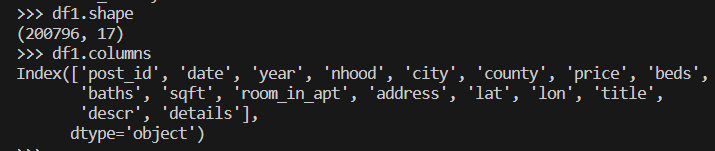

# project-apt

# Analyzing Trends in San Francisco Bay Area Apartment Rental Prices

## Executive Summary
The project "Analyzing Trends in San Francisco Bay Area Apartment Rental Prices" intends to investigate the alterations and trends in the San Francisco Bay Area's apartment rental pricing during a predetermined time frame. To pinpoint trends in rental pricing throughout the region's many neighborhoods, the initiative will examine data from a variety of sources, including real estate listings and property management websites. As part of the project, supply, and demand for rental properties, prevailing economic conditions, and the accessibility of facilities and features are all elements that may have an impact on rental pricing. At its core, the initiative seeks to shed light on the San Francisco Bay Area's apartment rental market now and provide projections about how rental prices will develop in the future. The project will also take into account elements that could affect rental pricing, including the availability of facilities and features, the supply and demand for rental units, and the state of the economy. The project's goal is to offer perceptions of the health of the San Francisco Bay Area apartment rental market and forecast future trends in rental prices.

Citation: Pennington, Kate (2018).  Raw Bay Area Craigslist Rental Housing Posts, 2000-2012. Retrieved from https://github.com/katepennington/historic_bay_area_craigslist_housing_posts/blob/master/raw_2000_2012.csv.zip
Citation: Pennington, Kate (2018). Raw Bay Area Craigslist Rental Housing Posts, 2013-2018. Retrieved from https://github.com/katepennington/historic_bay_area_craigslist_housing_posts/blob/master/raw_2013_2018.csv.zip
Citation: Pennington, Kate (2018).  Bay Area Craigslist Rental Housing Posts, 2000-2018. Retrieved from https://github.com/katepennington/historic_bay_area_craigslist_housing_posts/blob/master/clean_2000_2018.csv.zip

The following directories are available:
* `/assets`: It includes screenshots for all output.
* `/code`: It includes all the Python and R script files.
* `/data`: It includes all the data files.

## Statement of Scope
The following is covered in the project's scope, "Analyzing Trends in San Francisco Bay Area Apartment Rental Prices": 
* Data Gathering: The research will compile data on apartment rental costs in various San Francisco Bay Area communities from a variety of sources, including real estate websites, rental listings, and property management firms. 
* Data Analysis: The research will examine the data gathered to find trends and patterns in the cost of renting an apartment in various San Francisco Bay Area districts. The analysis will take into account variables including location, amenities, and economic situations that could affect rental pricing. 
* Data visualization will be used throughout the project to produce graphs and charts that show the trends and patterns discovered during the data analysis. 
* Prediction: Based on data analysis and visualization, the project will make predictions about future changes in rental prices for apartments in the San Francisco Bay Area. 
* Report: The project will produce a final report that summarizes the findings of the analysis, including an overview of trends and predictions for future rental prices in the San Francisco Bay Area apartment rental market. A thorough examination of the rental market or an in-depth analysis of how policy or regulatory changes may affect rent prices are not included in the project.
* **Statement Scope:** The statement scope in the title "Analyzing Trends in San Francisco Bay Area Apartment Rental Prices" refers to analyzing the patterns and changes in rental prices of apartments in the San Francisco Bay Area. The focus is on identifying trends in the rental market, such as whether prices are increasing or decreasing over time, and understanding the factors that may be driving these trends.
* **Unit Analysis:** The unit analysis in the title includes the following:
    * Time: The analysis will be conducted over a period of time from 2000-2018 to capture the trends in rental prices. 
    * Geography: The analysis will focus on the San Francisco Bay Area, which is a specific geographic region.
    * Housing Unit: The unit of analysis is apartments that are available for rent in the San Francisco Bay Area. The analysis will focus on rental prices for these apartments.
    * Additionally, the statement scope mentions "timeseries analysis and text mining," which suggests that the analysis will involve statistical techniques for analyzing time series data and natural language processing techniques for analyzing text data related to rental prices in the San Francisco Bay Area.

## Project Schedule
This project was finalized for execution in Feb 2023. The team working on this project has 3 members with area of expertise. 
The members are:

* Huang, Shujia (Shujia) - Data Scraping Specialist/ Data Cleaning Specialist
* Chandrika Kompella (Chandrika) - Data Consolidation Specialist
* Abdul Mujeeb (Abdul) - Data/Business Analyst

The idea of the project was to divide the workload between relevant members to have an efficient timeline for executing the project. Moreover, making use of each member's area of expertise helped in obtaining conducive insights and driving the project.

## Data Preparation
For datasets:
* The original dataset we downloaded from Kaggle: [aptrent_2000_2018.csv](data/aptrent_2000_2018.csv)
* The dataset we removed null values: [delete_null.csv](data/delete_null.csv)
* The dataset we modified the first index column: [cleaned_aptrent.csv](data/cleaned_aptrent.csv)
* The final dataset with new attribute "len_descr": [final_aptrent.csv](data/final_aptrent.csv)

For codes:
* The code of cleaned data: [data_clean.py](code/data_clean.py)
* The code of descriptive analysis: [basic_analysis.py](code/basic_analysis.py)
* The code of text mining:
    * 2 pairs of emotions analysis: [text_mining.R](code/text_mining.R)
    * Topic analysis, classification model, and named-entity recognition analysis: [text_mining.py](code/text_mining.py)
* The code of modeling:
    * Regression model: [modeling.R](code/modeling.R)
    * Neural Networks model: [modeling.py](code/modeling.py)

For descriptive analysis tables:
* The result of descriptive analysis for numeric variables: [descriptive_analysis_numeric.csv](data/descriptive%20analysis/descrptive_analysis_numeric.csv)
* The result of descriptive analysis for categorical variables: [descriptive_analysis_objects.csv](data/descriptive%20analysis/descrptive_analysis_objects.csv)

### Data Access
Using the URL, San Francisco Bay Area apartment rents have been examined and investigated. More than 2,000 000 records in the data set had null values in 17 columns. To use the Kaggle data for analysis, The datasets that are pertinent to the research query have been verified. In general, analyzing Kaggle data can be a great technique to discover patterns and trends in San Francisco Bay Area apartment rental rates. Before beginning any analysis, it is crucial to make sure the data is acceptable for the research question, correct, and relevant, and to clean and preprocess it using the right procedures.

https://www.kaggle.com/datasets/michaelbryantds/bay-area-craigslist-rentals

### Data Cleaning
A dataset's flaws, inconsistencies, and conflicts are found, fixed, or eliminated during data cleaning. Data cleaning makes sure that the data is precise, thorough, and consistent, all of which are necessary for trustworthy analysis. The following are some steps in data cleaning:

* Data inspection: The initial step in the data cleaning process is to thoroughly inspect the dataset to find any inaccuracies or discrepancies in the data. This entails looking at the data types, data structures, missing values, and outliers. There were lots of null values in apartment attributes such as number of beds, number of baths, area, latitude, and longitude in the original dataset. We assume these are variables that can impact apartment rents. So, we located the null values and removed any values from the dataset that included missing values.

   * This is the data shape for the initial dataset.
     
    
* Managing missing values: Analysis issues can arise from missing data. There are many approaches to handling missing values depending on the kind and quantity of missing data. We eventually produced a dataset with 1534 entries and 17 columns after eliminating the null values.
   * This is the data shape after we removed null values.
     

* Data standardization: Data entry differences between sources or systems can result in discrepancies in the dataset. By standardizing the data, you may make sure that it is formatted consistently throughout the dataset, for example by using the same units of measurement everywhere.
    * This is the data shape after we removed the useless first column. The 1st column was the index number of rows for the initial dataset.
      

* Managing outliers: Outliers have a big impact on the analysis's findings. Finding numbers that are significantly different from the rest of the data and either deleting them or replacing them with a more plausible approximation is recognizing outliers and dealing with them. After basic descriptive analysis for all variables, whether they are numeric or categorical, we found apartment rents concentrated below $10,000. Thus, we removed records which has a price of more than $10,000. Finally, we produced a dataset with 1520 entries and 17 columns.

•	This is the data shape after we removed outliers, which have a price of more than $10,000.
      

* Verifying data accuracy: To make sure that the data is trustworthy and acceptable for analysis, it is crucial to verify the accuracy of the data by comparing it to other sources or performing additional analysis.
You may make sure that the data is correct, comprehensive, and consistent, which is necessary for dependable analysis, by completing data cleaning.

### Data Transformation
The practice of altering or converting data to make it more valuable for analysis is known as data transformation. The creation of a new attribute based on preexisting data is one method of performing data transformation. Hence, we created a new column named length of description and want to analyze if the column has a strong relationship with the rental rates. As rental price plays a key role in determining if the apartment attributes influence the apartment rent. the new attribute has been created and the exploratory data analysis has been performed to identify any relationships between the new attribute and other attributes in the dataset. It has been noticed that it does not have a strong relationship with the price attribute. 
We want to analyze if the length of the description may affect rental rates, so we decided to create a new characteristic for it. Also, we want to find out if longer descriptions are linked to higher rental costs or if renters value descriptions with specific keywords more.
Here is the data shape after we added the new column.

### Data Reduction
Data reduction is the process of lowering a dataset's size or complexity while keeping the crucial details. This is frequently done to simplify the data and hasten the analytical process. Outlier removal: Outliers can skew the analysis's conclusions, therefore getting rid of them can make the dataset smaller without losing any crucial data. To simplify the analysis process by making the dataset smaller or less complex. When undertaking data reduction, it's crucial to exercise caution because it can also lead to information loss. Consequently, it's critical to comprehend the trade-off between size reduction and information loss. Normality checks and PCA analysis have been performed and it reduced the dataset to 1534 with 17 columns by reducing nearly 10,000 records making the dataset more relevant for analysis. We will explain the PCA analysis in the following Descriptive Statistics part.

### Data Consolidation
Data consolidation is the process of taking all your data from disparate sources throughout your organization, cleaning it up, and combining it in a single location. We only have one dataset in this project for now. We said that we created a new attribute named the length of description in the above parts. After creating the new attribute, we tried to join this column to the dataset. We separated the cleaned dataset into two parts: all columns before column 'descr' and column 'details'. Then, we combined the three data frames together ordered by all columns before column 'descr', the new column 'len_descr', and the column 'details'. The following is the code for this part:

### Data Dictionary
A short description of the table below. Be sure to link each row to a data file in your directory `data` so I know where it is stored.

| Attribute Name | Description | Data Type | Source | Data | Example |
|:---|:---|:---:|:---|:---|:---:|
| Post id | A unique identifier for the post | Alphanumeric | https://www.kaggle.com/datasets/michaelbryantds/bay-area-craigslist-rentals | [final_aptrent.csv](data/final_aptrent.csv) | 12345 |
| Date | The date when the post was created or updated | Date/time | https://www.kaggle.com/datasets/michaelbryantds/bay-area-craigslist-rentals | [final_aptrent.csv](data/final_aptrent.csv) | 5/3/2022  3:27:00 PM |
| Year | The year in which the property was built | Numeric | https://www.kaggle.com/datasets/michaelbryantds/bay-area-craigslist-rentals | [final_aptrent.csv](data/final_aptrent.csv) | 2000-2018 |
| Nhood | The name of the neighborhood where the property is located | Alphanumeric | https://www.kaggle.com/datasets/michaelbryantds/bay-area-craigslist-rentals | [final_aptrent.csv](data/final_aptrent.csv) | Upper East Side |
| City | The name of the city where the property is located | Alphanumeric | https://www.kaggle.com/datasets/michaelbryantds/bay-area-craigslist-rentals | [final_aptrent.csv](data/final_aptrent.csv) | San Francisco Bay Area |
| County | The name of the county where the property is located | Alphanumeric | https://www.kaggle.com/datasets/michaelbryantds/bay-area-craigslist-rentals | [final_aptrent.csv](data/final_aptrent.csv) | San Francisco Bay Area |
| Price | The price of the property | Numeric | https://www.kaggle.com/datasets/michaelbryantds/bay-area-craigslist-rentals | [final_aptrent.csv](data/final_aptrent.csv) | 500000 |
| Beds | The number of bedrooms in the property | Numeric | https://www.kaggle.com/datasets/michaelbryantds/bay-area-craigslist-rentals | [final_aptrent.csv](data/final_aptrent.csv) | 2 |
| Baths | The number of bathrooms on the property | Numeric | https://www.kaggle.com/datasets/michaelbryantds/bay-area-craigslist-rentals | [final_aptrent.csv](data/final_aptrent.csv) | 1 |
| Sqft | The total area of the property in square feet | Numeric | https://www.kaggle.com/datasets/michaelbryantds/bay-area-craigslist-rentals | [final_aptrent.csv](data/final_aptrent.csv) | 1000 |
| Room in apt | A Boolean variable indicating whether the property is a single room in an apartment | Numeric | https://www.kaggle.com/datasets/michaelbryantds/bay-area-craigslist-rentals | [final_aptrent.csv](data/final_aptrent.csv) | 1 |
| Address | The street address of the property | Alphanumeric | https://www.kaggle.com/datasets/michaelbryantds/bay-area-craigslist-rentals | [final_aptrent.csv](data/final_aptrent.csv) | 123 Main St |
| Latitude | The latitude coordinate of the property's location | Numeric | https://www.kaggle.com/datasets/michaelbryantds/bay-area-craigslist-rentals | [final_aptrent.csv](data/final_aptrent.csv) | 40.748817 |
| Longitude | The longitude coordinate of the property's location | Numeric | https://www.kaggle.com/datasets/michaelbryantds/bay-area-craigslist-rentals | [final_aptrent.csv](data/final_aptrent.csv) | -73.985428 |
| Title | The title or headline of the post | Alphanumeric | https://www.kaggle.com/datasets/michaelbryantds/bay-area-craigslist-rentals | [final_aptrent.csv](data/final_aptrent.csv) | Beautiful Apartment for Sale |
| Description | A brief description of the property and its features | Alphanumeric | https://www.kaggle.com/datasets/michaelbryantds/bay-area-craigslist-rentals | [final_aptrent.csv](data/final_aptrent.csv) | Lovely 2-bedroom apartment with city views |
| Length description  | Count of description for apartment details | Numeric | https://www.kaggle.com/datasets/michaelbryantds/bay-area-craigslist-rentals | [final_aptrent.csv](data/final_aptrent.csv) | 865 |
| Details | Additional details about the property, such as amenities, utilities, or nearby attractions | Alphanumeric | https://www.kaggle.com/datasets/michaelbryantds/bay-area-craigslist-rentals | [final_aptrent.csv](data/final_aptrent.csv) | Gym, rooftop terrace, laundry room, Cats  |

## Descriptive Statistics and Analysis
We did basic descriptive analysis for both numeric and alphanumeric variables.
* The result of descriptive analysis for numeric variables: [descriptive_analysis_numeric.csv](data/descriptive%20analysis/descrptive_analysis_numeric.csv)
* The result of descriptive analysis for categorical variables: [descriptive_analysis_objects.csv](data/descriptive%20analysis/descrptive_analysis_objects.csv)

### Target Variable Plot
After cleaning the data, we created a Q-Q plot and histogram for the price, which is our target variable.

### Principal Components Analysis (PCA)
And we conducted principal component analysis (PCA) for the numerical variables.

We discovered that only a few entries had rents higher than $10,000. Therefore, we considered these rents as outliers and removed them. Here are the visualizations for the price without expensive rents.

In addition, we created a new attribute called "length of description." We aim to analyze if this new attribute can be useful for our research.

The comparison between the two scree plots indicates that latitude and longitude may not be suitable for analysis. However, we have decided not to remove them at this point, as we want to explore the potential relationship between the apartment locations and the price in future analysis.

### Descriptive Statistics for variables
After reviewing and conducting necessary descriptive statistical analyses on our final dataset, we have decided to consider the number of bedrooms, number of bathrooms, apartment area, and apartment's year of construction as our independent variables for further analysis. We have checked the descriptive statistics for all the variables we are interested in exploring. Here are the results of the descriptive statistics:

### Target Variable Components Plot
To better visualize the relationship between our target and independent variables, we utilized the pairs () function in R. Below is the scatter plot depicting the relationship between our independent variables:

To better visualize the relationship between our target and independent variables, we utilized the pairs () function in R. Below is the scatter plot depicting the relationship between our independent variables:

### Correlation Matric for the Target Variable and Independent Variables
Based on the target variable components plot above, it is evident that there are some relationships between the number of bedrooms, number of bathrooms, year of construction of apartments, and the target variable price. However, these relationships may not be linear. To further explore the correlation between the independent variables and the target variable (apartment price), we created a correlation matrix.

According to the correlation analysis, we found that the apartment area and price, apartment area and the number of bedrooms, and apartment area and the number of bathrooms have a strong positive correlation, all greater than 0.5. In addition, there is a positive correlation between the number of bedrooms/bathrooms and the apartment price, but the correlation coefficient is less than 0.5.

## Text Mining
Text mining, also known as text data mining or text analytics, is a process of analyzing and extracting useful information from large amounts of unstructured textual data. This can include analyzing documents, emails, social media posts, and other forms of text-based content. Text mining typically involves the use of natural language processing (NLP) techniques, such as tokenization, stemming, and sentiment analysis, to transform the raw text data into a structured format that can be analyzed and visualized. Text mining aims to discover patterns, trends, and insights that may be hidden in the text data and can help inform decision-making, identify customer preferences, or improve business operations. Applications of text mining can be found in a wide range of fields, including marketing, healthcare, finance, and social sciences. Some examples of text-mining techniques include topic modeling, text classification, entity extraction, and opinion mining.

Text analysis on the Bay Area Craigslist rentals dataset can provide valuable insights into the rental market in the Bay Area. The dataset contains over 19,000 rows of data, each representing a rental listing on Craigslist. The data includes information on the rental units' location, price, size, and other features.

One common analysis that can be performed on this dataset is sentiment analysis. Sentiment analysis can help determine the overall sentiment of the rental listings, whether positive, negative, or neutral. This can provide insights into how renters feel about the rental market in the Bay Area and whether there are any specific pain points or areas for improvement. Another analysis that can be performed is topic modeling. Topic modeling can help identify common themes or topics that appear in rental listings. This can provide insights into what renters are looking for in a rental unit and any trends or patterns in the market. Another useful analysis is keyword analysis. This involves identifying the most common keywords or phrases in the rental listings. This can provide insights into the most important factors that renters consider when looking for a rental unit, such as location, price, and amenities. Overall, text analysis on the Bay Area Craigslist rentals dataset can provide valuable insights into the rental market in the Bay Area, including renter sentiment, common themes and topics, and important keywords and phrases. These insights can help landlords, property managers, and real estate professionals make more informed decisions about rental properties in the Bay Area.

We have performed a comprehensive text analysis on the Bay Area Craigslist rentals dataset. Here's a brief summary of each step:

* Loading data and renaming column: You started by loading the dataset and renaming the "description" column to "apartment description" to make it clearer.
* Converting to lowercase: To simplify the analysis, you converted all text to lowercase so that "Apartment" and "apartment" would be treated as the same word.
* Removing numerical and punctuation: To focus on the words themselves rather than special characters or numbers, you removed all punctuation and numerical values from the text.
* Removing stopwords: Stopwords are common words that do not carry much meaning in a sentence, such as "a" and "the". You removed these words to focus on the more meaningful content of the text.
* Checking top 30 words: After cleaning the text, you checked the top 30 most frequently occurring words in the dataset to get an initial sense of the content.

  
  
  We generated a plot with the proportion of occurrence of a word. Below, we plot the words in the dataset with a proportion greater than 0.5 before stemming data.
  
* Stemming: Stemming is the process of reducing words to their root form, such as "running" to "run". This helps to group together similar words and reduce the number of unique words in the analysis.
  
  And here is the plot of the words in the dataset with a proportion greater than 0.5 after stemming data.
  
* Creating document term matrix: Finally, created a document-term matrix using vectorization. This converts the text data into a numerical format that can be used for further analysis, such as machine learning algorithms.

## Sentiment Analysis
Sentiment analysis is a natural language processing technique that uses computational linguistics to evaluate the emotional tone of text-based data, such as tweets, social media posts, or customer reviews. It categorizes the text into subjective categories such as positive, negative, or neutral, or other valences such as strong, weak, powerful, or powerless. Sentiment analysis enables organizations to determine people's attitudes, opinions, or views on various topics, including products, services, brands, or politicians. The sentiment analysis process involves collecting the text and storing it in a database, labeling each block of text as positive, neutral, or negative based on the terms contained in it, adjusting the valence based on the context of the term, and assigning an overall score to each record. Psycho-social dictionaries are used to store the various valences, which contain words or terms and their associated attitudes. The binary score is commonly used for each label in the dictionary, which categorizes a word as either positive or negative. However, more detailed analysis can be achieved through continuous scales that include strongly positive, moderately positive, neutral, not moderately positive, and not strongly positive, which are useful for advanced statistical modeling. Different psycho-social dictionaries exist for various types of attitudes, including militaristic, political, distance/time, religious, and legal, which can be explored further for more specific sentiment analysis. For the first pair emotion, we selected happy-sad. We create a new variable called contentment that is calculated by taking the value of joy and subtracting sadness from it. This creates a "degree" of contentment. To avoid the visualization of the "degree" of contentment being too busy, we focus on the top 10 positive contentment words and the bottom 10 negative contentment words. Here is a plot for the "degree" of contentment.

Similarly, we selected fear-trust for the second pair emotion. We create a new variable called trustworthiness which is calculated by taking the value of fear and subtracting trust from it. It retrieved the sentiment scores for trust and fear from NRC. It creates the “degree” of trustworthiness. Here is a plot for the top 10 positive trustworthy words and the bottom 10 negative trustworthy words.

The results were consistent with the assumption that apartment owners prefer to describe their apartments as positively as possible to attract people to rent.

### Topic Analysis
Topic analysis, also known as topic modeling, is a natural language processing technique used to discover latent topics in a collection of documents. It helps identify the main themes and topics that are discussed in the text and can be useful for various applications, such as understanding customer feedback or monitoring public opinion. To perform topic analysis on apartment descriptions, we can use techniques such as Latent Dirichlet Allocation (LDA) or Non-negative Matrix Factorization (NMF) in R. These techniques help identify the underlying topics and themes by clustering the words that tend to appear together in the text. To start, we need to prepare the data by cleaning the text and removing stop words and irrelevant information such as numbers, punctuation, and common words that do not contribute to the topic. Then, we can create a document-term matrix that represents the frequency of each term in each document.

For apartment descriptions, some of the potential topics could include location, amenities, price, and features such as size, layout, and style. By identifying the main topics, we can gain insights into what aspects of the apartment are emphasized in the descriptions and how they affect people's perceptions and preferences.
Overall, topic analysis can be a powerful tool for understanding the main themes and topics in apartment descriptions and other types of text data. It can help identify patterns and trends and provide insights into what people value and prioritize when searching for an apartment.

Based on the bar chart of the number of terms categorized by bedroom numbers, we can see that the majority of apartment descriptions have 1 or 2 bedrooms. Additionally, we can see that the number of terms used to describe apartments tends to increase as the number of bedrooms increases, which may suggest that apartments with more bedrooms are typically larger and have more features to describe. However, it is important to note that this conclusion is based solely on the assumption that the dataset accurately represents apartment descriptions in general and may not be true for all cases.

Next, the team conducted a topic analysis using LDA to create topics based on word frequency. 

The 5 topics are:

The result showed that most topics were related to the conveniences of living, such as proximity to a park or being in a business center. 
The results were consistent with the previous sentiment analysis.

### Classification
The team then moved on to classification in sentiment analysis by creating a term-frequency inverse-document-frequency (TF-IDF) matrix. They set the top 1,500 most frequently occurring terms and terms that occur in a maximum of 90% of the documents, but at least in 5 documents. The dataset was split into 80% training and 20% testing data. However, the classification model was not conclusive due to the lack of a labeled sentiment column in the dataset. The team used bedroom numbers to label the classification model but found that it had no relationship with the users' emotions. The accuracy score was only 52.63%, which indicates that having a labeled sentiment column would improve the accuracy of the model.

We plot a classification matrix for the sentiment analysis classification model.

And here is the accuracy score for this classification model.

### Name-Entity Recognition Analysis
Finally, the team conducted a named-entity recognition analysis, which also did not provide conclusive results due to the lack of a labeled sentiment column. According to earlier results of sentiment analysis, apartment owners prefer to describe the attributes (aka strength) of apartments as much as possible to attract renters. It's unavoidable to use lots of nouns, adjectives, and verbs to describe an apartment. Here's the length of our named entity lists:

Overall, the team recommends including a labeled sentiment column in the dataset to improve the accuracy of the analyses.

## Data Splitting and Sub-Sampling
Data splitting and sub-setting is a common technique in machine learning and statistical analysis that involves dividing a dataset into two or more subsets. This is done for the purpose of building and testing a model that can accurately predict outcomes based on the data. 
In this case, we split the data into different percentages, such as 60%/40% and 70%/30%, to determine which split would be most effective for their analysis. They then calculated summary statistics for each split to compare their results. 
After analyzing the summary statistics, we ultimately decided to use a 60%/40% split for their analysis, as it provided the most similar results between the training and testing sets. This means that 60% of the data was used for training the model, while the remaining 40% was used to evaluate the model's performance. By using this approach, we were able to build a more accurate and reliable model for predicting outcomes based on the data. 

## Modeling
Modeling refers to the process of creating a simplified representation of a complex system to better understand or predict its behavior. In the context of data science and statistics, modeling refers to the process of using mathematical or statistical techniques to identify patterns and relationships in data. and then using these patterns to make predictions or gain insight into the underlying system. Models can take many forms, including regression models, decision trees, neural networks, and many others. The choice of model depends on the specific problem being addressed and the nature of the data being analyzed. Once a model has been developed, it can be used to make predictions on new data or to gain insights into the underlying relationships in the data. 

## Select Modeling Techniques
We have selected 2 models that are Multiple regression and Neural network for prediction. 
Multiple regression is a statistical technique that predicts a single dependent variable based on multiple independent variables, assuming a linear relationship. It estimates coefficients for each independent variable to determine their impact on the dependent variable. 
Neural networks are a type of nonlinear model that simulates the structure and function of the data. They consist of layers of interconnected nodes that learn complex patterns and relationships in the data to make predictions. They can identify nonlinear relationships but are more complex and computationally intensive than multiple regression. 
The choice between the two techniques is based on our data and prediction. Multiple regression is simpler and easier to interpret, while neural networks are more flexible but require more data and computational resources.

### Justification
We have chosen these two models for our apartment data for the analysis, multiple regression was likely used because it is a well-established and widely used technique for predicting the value of a **dependent variable** that is **Price** based on **multiple independent variables** such as a **number of bedrooms, number of Bathrooms, Area of SQFT, Year of build**. Neural networks were likely used because they are particularly good at capturing complex patterns in our apartment data, which may have been important in this analysis if there were non-linear relationships between our variables. Ultimately, the choice of which model to use will depend on the specific problem being addressed and the characteristics data.  

### Assumptions of Modelling Technique 
Assumptions of a model refer to the underlying conditions or requirements that must hold true in order for the model to be accurate and reliable. In the case of multiple regression and neural network models, there are specific assumptions that need to be considered: 

**Assumptions of Multiple Regression:**
* **Multicollinearity:** Our VIF values of all variables are less than 5 which means our variables are moderately correlated

  

* **Normality:** The errors should be normally distributed. 

  
  
* **Auto-correlation:** As the auto-correlation value is 0.48 there is a weak correlation and also the P value is also 0 which means our variables are significant.  

**Assumptions of Neural Networks:**
 We have a few assumptions for our NN model. 
  Our Input variables are independent of each other. 
  Our Input variables are numeric. 
  Output variables are transformed into numeric values. 
  We have 1520 observations, and we don't see overfitting. 

## Building Models
We chose two models i.e., Multiple regression and Neural network. Multiple regression is a linear model that uses multiple independent variables to predict a single dependent variable. Neural networks have the advantage of being able to capture nonlinear relationships between variables, whereas multiple regression is limited to linear relationships. 

### Multiple Regression

**Summary for Training Data Set**

The results from our analysis show that the number of bedrooms and bathrooms have a small, insignificant effect on the rental price of apartments in the San Francisco Bay Area, while the area and year of the apartment have a significant impact on price. Specifically, the coefficient for the area is positive, indicating that as the area of the apartment increases, the rental price also increases. The coefficient for the year of the apartment is also positive, suggesting that as the year of the apartment increases, the rental price also increases. The intercept coefficient is negative, which means that rental prices may be lower for apartments with zero square feet.  The adjusted R-squared value of 0.2937 indicates that 29.37% of the variability in rental prices can be explained by the independent variables included in the model. Additionally, the F-statistic of 95.7 with a very low p-value suggests that the overall model is statistically significant.

**Summary of the Testing Data Set**

The model shows that the number of bedrooms and the number of bathrooms is not significant predictors of rental prices as their p-values (0.4610 and 0.2759, respectively) are greater than the common significance level of 0.05. In contrast, the area of the apartment and the year the apartment was built are significant predictors of rental prices as their p-values are less than 0.05. The multiple R-squared values of 0.3365 indicate that the model explains about 33.65% of the variation in rental prices. The adjusted R-squared value of 0.3321 suggests that adding more predictor variables to the model may not significantly improve its performance. The F-statistic value of 76.47 and the associated p-value of less than 2.2e-16 indicate that the model is statistically significant and has at least one significant predictor.

The residual standard error (RSE) of 1095 suggests that the model's predictions have an average error of 1095. The residual plot should be examined to check whether the assumptions of linearity, normality, and homoscedasticity hold. Overall, the model suggests that the area of the apartment and the year the apartment was built are the two most important factors affecting rental prices in the San Francisco Bay Area. 

### Neural Network

**Results of the Training Data in Neural Network**
* **Mean Absolute Error (MAE):** The mean absolute error (MAE) of the predictions on the training data is 936.74, which means that on average, the neural network's predicted values are off by 936.74 from the actual values. 
* **Mean Squared Error (MSE):** The mean squared error (MSE) of the predictions on the training data is 1,834,902.25, which is a measure of the average squared difference between the predicted and actual values. 
* **R-squared (R2):** The R-squared value of the predictions on the training data is -0.0068, which indicates that the model is not performing well on the training data and is not able to explain much of the variance in the target variable. 

Overall, the training result suggests that the neural network model is not performing well on the training data, which may also indicate that the model is not well-suited for predicting rental prices in the San Francisco Bay Area. 

**Results of the Testing  Data in Neural Network**
* **Mean Absolute Error (MAE):** The MAE measures the average magnitude of the errors in a set of predictions, without considering their direction. The MAE for this neural network model is 968.35, which means that on average, the predicted rental prices are off by $968.35. 
* **Mean Squared Error (MSE):** The MSE measures the average of the squared differences between the predicted and actual values. The MSE for this neural network model is 2024865.68, which is the squared error of the MAE. 
* **R-squared (R2):** The R-squared value measures the proportion of variance in the dependent variable (rental prices) that is explained by the independent variables (number of bedrooms, number of bathrooms, area, and year of the apartment). The R-squared value for this neural network model is -0.0035, which indicates that the model is not fitting the data well, as the R-squared value is negative. 

Overall, the results suggest that the neural network model is not performing well in predicting rental prices for the San Francisco Bay Area apartments, as the MAE and MSE are quite high, and the R-squared value is negative. 

## Model Assessment
Model assessment is an important step in evaluating the performance of a predictive model. It helps to determine the accuracy of the model in predicting new data. 

There are several metrics that can be used to assess the importance of a model, including mean absolute error (MAE), mean squared error (MSE), and R-squared (R2). MAE and MSE measure the average difference between the predicted and actual values, with lower values indicating better performance. R2 measures how well the model fits the data, with higher values indicating better performance. 

In addition to these metrics, it is also important to assess the significance and contribution of each variable in the model. This can be done through techniques such as feature importance analysis or variable selection methods. These techniques help to identify the most important variables in the model and eliminate any unnecessary or redundant variables, which can improve the model's accuracy and efficiency. 

The results for the models i.e., multiple regression and Neural network are as below.

## Conclusion and Discussion
### Summary 
From our analysis starting from data visualization to modeling, we were able to figure out the important variables that are useful for predicting the model. The important variables are bedroom, area, Bathroom, and Price. We have performed two models’ multiple regression and Neural Network from multiple regression the observations as per our analysis the variables are statistically significant as they are lower than 0.05 and R square is 0.3 by this, we can conclude that the relationship is moderate. The Multiple regression model has an initial R-Squared value of 0.3109, indicating that 31.09% of the variability in the response variable (apartment rental prices) can be explained by the independent variables included in the model. The training R-Squared value is 0.2968, and the testing R-Squared value is 0.3365, which means that the model explains 29.68% and 33.65% of the variability in the training and testing data, respectively.

The mean absolute error (MAE) measures the average magnitude of the errors in predictions made by a model. The MAE value for the training data set is 936.737501, which is the average deviation of the model's predictions from the actual values in the training data set. The MAE value for the testing data set is 968.3519122, which is the average deviation of the model's predictions from the actual values in the testing data set. The mean squared error (MSE) measures the average of the squared differences between the predicted and actual values. The MSE value for the training data set is 1834902.253, and the MSE value for the testing data set is 2024865. 681. The neural network model has a training R-Squared value of -0.006836066 and a testing R-Squared value of -0.0035151317339150445, indicating that the model is not a good fit for the data. The MAE value for the training data set is 936.737501, and the MAE value for the testing data set is 968.3519122. The MSE value for the training data set is 1834902.253, and the MSE value for the testing data set is 2024865.681. Overall, the Multiple regression model performs better than the neural network model for this dataset. The linear regression model explains more of the variability in the data and has lower MAE and MSE values for both the training and testing data sets.

### Implications for people and Businesses
Based on the analysis of trends in San Francisco Bay Area apartment rental prices, the following implications can be drawn for people and businesses:
* **For renters:** The increase in rental prices in the Bay Area means that renters will have to spend more on housing, which could impact their overall budget and lifestyle. Renters may have to consider alternative housing options such as shared apartments or living further away from the city to save money.
* **For property owners:** Property owners can take advantage of the high rental demand and increase their rental prices. However, they should also be aware of the potential impact of rising prices on the rental market. Increasing rental prices too much could lead to a slowdown in demand and longer vacancy periods.
* **For businesses:** Businesses can use the analysis to better understand the rental market trends in the Bay Area. They can use this information to make strategic decisions about their business operations, such as where to open new locations or whether to expand their current facilities. Businesses can also use this information to negotiate favorable rental agreements.
* **For policymakers:** The analysis shows that the rental prices in the Bay Area are increasing, which could have negative social and economic impacts. Policymakers can use this information to implement policies to address the housing affordability crisis, such as rent control laws or incentives for developers to build affordable housing.

### Limitations
There are several limitations to this research that should be taken into consideration when interpreting the results. Some of these limitations include:
* **Limited dataset:** The analysis was conducted based on a limited dataset of apartment rental prices in the San Francisco Bay Area. Therefore, the findings may not be representative of the broader rental market.
* **Data quality:** The accuracy of the analysis depends on the accuracy and completeness of the data used. In this case, the data used for the analysis may contain errors or inaccuracies that could affect the reliability of the results.
* **External factors:** The analysis does not consider external factors that may influence rental prices in the San Francisco Bay Area, such as changes in the local economy, government policies, or natural disasters.
* **Model limitations:** The predictive models used in this analysis have limitations and assumptions that may not always hold true. For instance, the neural network model assumes that the relationship between the input variables and the output variable is linear.
* **Causality:** The analysis does not establish causality between the predictors and the outcome variable. Although the models can predict rental prices based on the input variables, they cannot establish a causal relationship between them.
* **Time limitation:** The analysis is based on data up to a certain point in time, and the rental market may change over time, which may affect the validity of the results.
* **Location limitation:** The analysis only considers apartment rental prices in the San Francisco Bay Area, and the results may not be generalizable to other regions or types of rental properties.

### Future Directions
Based on the limitations of the current research, some possible directions for future research in analyzing trends in San Francisco Bay Area apartment rental prices could include:
* **Incorporating additional variables:** This study focused on a limited number of variables, but there are likely many other factors that influence apartment rental prices in the Bay Area. Future research could consider incorporating additional variables, such as crime rates, proximity to public transportation, or the availability of parking.
* **Examining sub-regions within the Bay Area:** This study looked at rental prices across the entire Bay Area, but there may be significant variation in prices across different sub-regions. Future research could examine rental price trends in specific areas, such as San Francisco, Oakland, or Silicon Valley.
* **Exploring the impact of external factors:** This study did not examine how external factors such as changes in the overall economy or shifts in housing policy might impact rental prices in the Bay Area. Future research could explore these factors and their influence on rental prices.
* **Comparing rental prices to other regions:** While this study focused specifically on rental prices in the Bay Area, it would be valuable to compare these prices to rental prices in other regions with similar housing markets, such as New York City or Boston.
* **Long-term trends:** The current study focused on rental prices over a two-year period. Future research could examine longer-term trends to identify changes over time and provide more insight into the dynamics of the rental market in the Bay Area.

